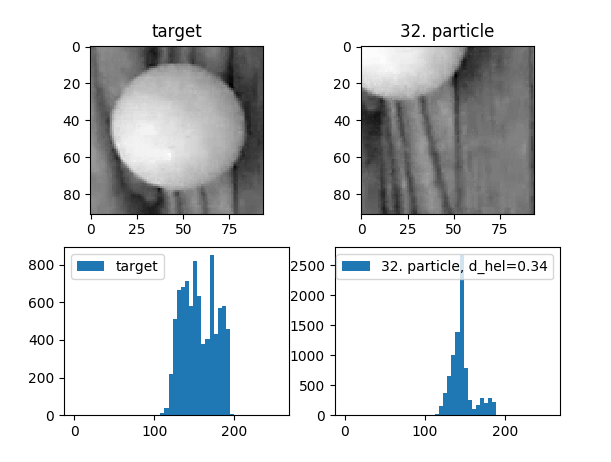
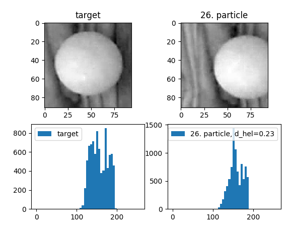
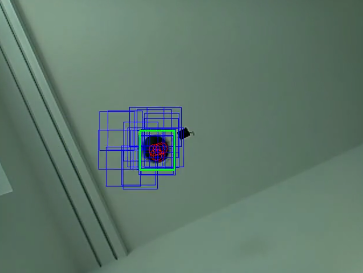

# PingPong_tracker
The goal of the project to track a ping pong ball. The long term goal is to estimate the spin of the ball. To achieve those goals first and foremost one needs to be able to gather footage at high enough frequency and implement a procedure to track the ball. At the moment the footage is collected with a raspberry pi camera at a framerat of 80-90 Hz. For the tracking of the ball two different approches are given. On the one hand the ball is tracked via a particle filter framework more specifically via the [**Condensation algorithm**](https://en.wikipedia.org/wiki/Condensation_algorithm). On the other hand as a alternative the ball is tracked directly with the ciruclar hough transform. 

## Frames from video
The first important task to solve is to retrieve the "raw" pictures from a video e.g. from a .mp4. Additionally, it is extremely beneficial for the filter to know the exact timestamp of those pictures. To accomplish those tasks the functionality of ffmpeg and ffprobe under Linux are leveraged. If you execute the file `frames_from_video.sh` from the command line (make sure file is executable) all images of the video are extracted and stored as .png. On top of that the pts and dts timestamps are stored in the file timestamps.json. `pts` is an acronym for presentation time stamp and `dts` is an acronym for decoder time stamp. Both are extracted but actually only the pts timestamps are relevant later in the filter framework. To extract frames and timestamps of a video, type the following:

`./frames_from_video.sh <video> <folder to store frames and time stamps>`

## Installing python package
To run the motion tracker, install required python package by typing:
`pip install -r requirements.txt`

## Track the ball via particle filter
To start the tracker type:

`python motion_tracker.py --n_particle <desired number of particles> <path to folder with frames> --method 'particle'`

This will open a screen where you can select the region of interest. After pressing enter, the tracker will try to estimate the position of the selected object in the next frame. The region is then shown as green rectangle.

## Selection of target histogram
The image below shows the histogram of the ball and some surrounding.   

## Computation of measurement update
### Hellinger distance
Every update step of the particle filter procedure involves the weighing of every single particle. This weighing is accomplished by computing the histogram within a rectangle around the particles center point and then comparing with the target histogram. As a comparison measure the so-called [**Hellinger distance**](https://en.wikipedia.org/wiki/Hellinger_distance) is selected. The **Hellinger distance** is related to the famous Bhattacharyya coefficient and computed as follows:

<a href="https://www.codecogs.com/eqnedit.php?latex=d_{hellinger}(p^*,p(\vec{x_t}))&space;=&space;\sqrt{1&space;-&space;\sum_{j=1}^{m}&space;\sqrt{p_u^*(\vec{x_0})p_u(\vec{x_t})}}&space;\newline&space;\vec{x_0}:=&space;\text{States&space;of&space;target}&space;\newline&space;\vec{x_t}:=&space;\text{States&space;of&space;particle&space;t}&space;\newline&space;p_u^*(\vec{x_0}):=\text{Normalized&space;number&space;of&space;intensity&space;values&space;of&space;target&space;measurement&space;rectangle&space;that&space;lie&space;in&space;bin&space;\textit{u}}&space;\newline&space;p_u(\vec{x_t}):=\text{Normalized&space;number&space;of&space;intensity&space;values&space;of&space;particel&space;\textit{t}'s&space;measurement&space;rectangle&space;that&space;lie&space;in&space;bin&space;\textit{u}}&space;\newline&space;m:=\text{Number&space;of&space;bins&space;of&space;histograms}" target="_blank"></a>

 The **Hellinger distance** takes values between 0 and 1. It takes 0 if there is perfect overlap and 1 if there is no overlap at all for the two distributions or in this case for the two discrete histograms. The figures below show how the value for the Hellinger distance behaves for the different pairwise fictional normal distribution. Both distributions have the same standard deviation but different mean values expect for the first plot where both entities are the same. The bigger the average shifts the closer the Hellinger distance goes to 1.

If you want to play around with the different mean shift values or standard deviations or even different distribution like laplace you can do that by manipulating `distribution_comparison.py` accordingly. As mentioned in the equation the input for the computation of the Hellinger distance are the normalized bin counts i.e. 

The following two plots show the difference of histograms of the cropped image of the target and a particle respectively the corresponding Hellinger distance value. As can be seen in the first example below even if the ball is almost not part of the cropped image anymore the value of the Hellinger distance is still below 0.5. This is due to the fact that the background on both images is still the same or really similar. The second image shows a particle where the ball is in the cropped image with a major part. Thus the Hellinger distance is smaller.

### Importance sampling
Obviously the question arises how to use the computed Hellinger distance to compute the posterior estimate of the position of the ping pong ball. Ideally, one would know the posterior distribution of p(x|z). Unfortunately, this is not the case here i.e. one does not know how exactly the different Hellinger distances are statistically distributed. To still be able to approximate the posterior distribution a so-called biased distribution q(x|z) is introduced. We assume that the posterior distribution is proportional to the biased distribution i.e.

This also means that if we re-sample our prior estimated particles according to the biased distribution one can approximate the posterior distribution p(x|z) since samples with high weights are chosen many times. For the biased distribution q(x|z) it is assumed that it is the normal distribution with zero mean and a specific variance:

### Estimation of the ball
The effective position of the rectangel containing the ball is the minimum mean square error (MMSE) estimator that this estimate minimize the mean squared error to the true center position of the rectangle containing the ball. 

### Result of tracker
As an example of the tracker a black ball is used as a pendulum. The tracker tries to track the position of the ball. In the image below you see all rectangles of the filter with a blue border respectively the MMSE estimate has a green border. The red circle(s) represent the centers of the rectangles after resampling. In the image below there are only six center(s). This is done due to resampling to account for the higher probability that the ball is in this area. In order to avoid a situation where the filter has only one particle at every propagation step there is some noise applied. Hence, filter is more robust against fast motions.

The correspoding video can be found in:

## Track the ball via circular hough transform
The [circular hough transform](https://en.wikipedia.org/wiki/Circle_Hough_Transform) tries to extract circles in imagery by process the image in a way that allows to associates circles in a image to an accumulator space that represents the 3D parameter space for circles. By doing so one can than effectively where the images are localized. Generally the steps of the circular hough transform involve the following:
* Reduce noise on image e.g. with Gaussian or median blurring
* Convert to gray scale image
* Apply the Canny-edge detector
* Vote the possible circles in the accumlator space
* Local maxima in the accumlator space represent circles in the image

OpenCV offers a direct implementation of the circular hough transform described in more detail [here](https://docs.opencv.org/2.4/doc/tutorials/imgproc/imgtrans/hough_circle/hough_circle.html).

To start the tracker type:

`python motion_tracker.py  <path to folder with frames> --method 'hough'`

As an example of the circular hough tracker in the image below the green circle respectively the red dot show the estimated circle respectively the mid point of the circle.

An example video of the tracker is given in:

## Creating video from stored processed frames
You can select the option to store the processed frames similar to the image shown in the last section. If you want to create a video based on those frames, you can use the script video_from_frame.sh by typing:

`./video_from_frame.sh <image folder> <desired frame rate e.g. 30>`

The video is then stored in the processed folder with the name output.mp4.

## Run node
- Main computer export ROS_MASTER_URI=http://192.168.1.13:11311
- rpi computer export ROS_MASTER_URI=http://192.168.1.13:11311
- rpi: export ROS_HOSTNAME=192.168.1.14
- rpi: . ros_catkin_ws/devel/setup.bash
- Main: roscore
- rpi: roslaunch raspicam_node camerav1_1280x720.launch
- Main: second terminal: export ROS_MASTER_URI=http://192.168.1.13:11311
- rqt_image_view
- Next step: Use opencv c++ libarary to make circular hough transform in C level offline on computer work
https://docs.opencv.org/4.0.0/d4/d70/tutorial_hough_circle.html
g++ test.cpp -L/home/fabian/opencv_build/opencv/build/lib -lopencv_highgui -lopencv_imgcodecs -lopencv_imgproc -lopencv_core -o Test
g++ track_ball.cpp -L/home/fabian/opencv_build/opencv/build/lib -lopencv_highgui -lopencv_imgcodecs -lopencv_imgproc -lopencv_core -lboost_filesystem -lboost_system -o online_tracker 