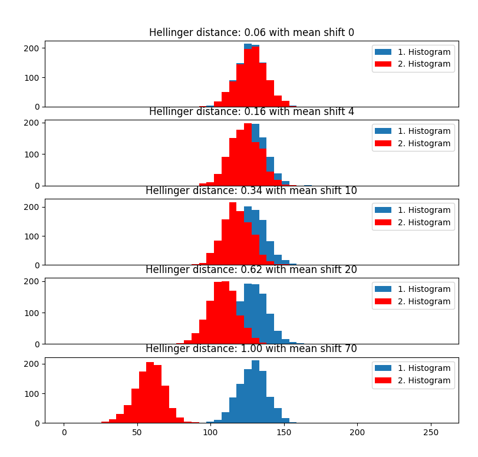

# PingPong_tracker
Tracks ball of ping pong via vision via a particle filter framework more specifically via the [**Condensation algorithm**](https://en.wikipedia.org/wiki/Condensation_algorithm).
## Selection of target histogram
The image below shows the histogram of the ball and some surrounding.   

## Computation of measurement update
Every update step of the particle filter procedure involves the weighing of every single particle. This weighing is accomplished by computing the histogram within a rectangle around the particles center point and then comparing with the target histogram. As a comparison measure the so-called [**Hellinger distance**](https://en.wikipedia.org/wiki/Hellinger_distance) is selected. The **Hellinger distance** is related to the famous Bhattacharyya coefficient and computed as follows:

<a href="https://www.codecogs.com/eqnedit.php?latex=d_{hellinger}(p^*,p(\vec{x_t}))&space;=&space;\sqrt{1&space;-&space;\sum_{j=1}^{m}&space;\sqrt{p_u^*(\vec{x_0})p_u(\vec{x_t})}}&space;\newline&space;\vec{x_0}:=&space;\text{States&space;of&space;target}&space;\newline&space;\vec{x_t}:=&space;\text{States&space;of&space;particle&space;t}&space;\newline&space;p_u^*(\vec{x_0}):=\text{Normalized&space;number&space;of&space;intensity&space;values&space;of&space;target&space;measurement&space;rectangle&space;that&space;lie&space;in&space;bin&space;\textit{u}}&space;\newline&space;p_u(\vec{x_t}):=\text{Normalized&space;number&space;of&space;intensity&space;values&space;of&space;particel&space;\textit{t}'s&space;measurement&space;rectangle&space;that&space;lie&space;in&space;bin&space;\textit{u}}&space;\newline&space;m:=\text{Number&space;of&space;bins&space;of&space;histograms}" target="_blank"></a>

 The **Hellinger distance** takes values between 0 and 1. It takes 0 if there is perfect overlap and 1 if there is no overlap at all for the two distributions or in this case for the two discrete histograms. The figures below show how the value for the Hellinger distance behaves for the different pairwise fictional normal distribution. Both distributions have the same standard deviation but different mean values expect for the first plot where both entities are the same. The bigger the average shifts the closer the Hellinger distance goes to 1.

If you want to play around with the different mean shift values or standard deviations or even different distribution like laplace you can do that by manipulating `distribution_comparison.py` accordingly.